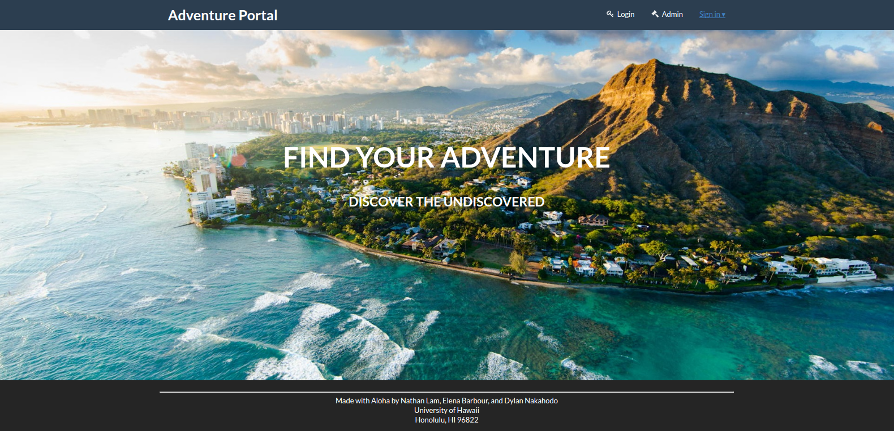
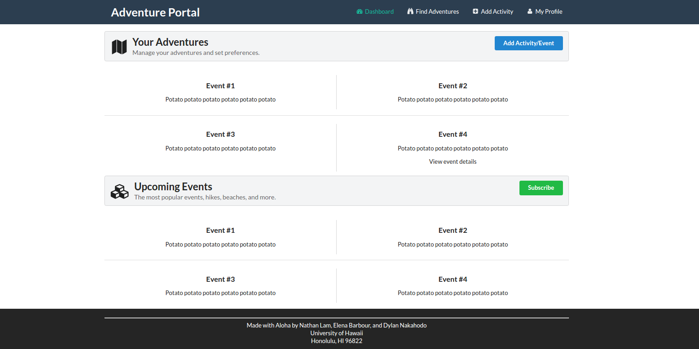
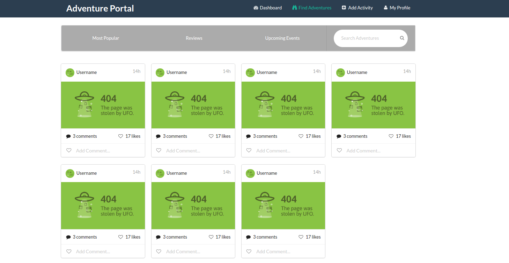

# Table of Contents

* [About Adventure Portal](#about-adventure-portal)
  * [Key Features](#key-features)
  * [Navigation](#navigation)

# About Adventure Portal
Adventure Portal is a tool built by students at the University of Hawaii to help members of the UH community with find exciting adventures to embark on and organize activities with similar minded people. Have an awesome hangout spot that would be perfect on the weekends? Want to share your best getaway activity? Or do you just want to explore and find something new with other students who just want to do the same?

Let Adventure Portal help you explore your interests and help you embark on your next adventure.

## Key Features
* Create profiles that list your interests
* Create activities that other people can browse and join
* Secure login via the UH authentication system
* Browse for new activites and adventures based on your interests

## Navigation
### Landing Page
Logged out users are presented with information about Adventure Portal and are unable to view featured activities until the user logs in. The user can log in by selecting the "login" link on the top right of the navigation bar.

### Home Page
After logging in, the user's dashboard with pinned projects are shown as well as featured/suggested activities. These matches are based on the interests listed in the user's profile. For a new user with no added activities, the Portal will ask the user to update his/her interests in order to present similar related activities. 

### Find Adventures Page
Users can find new adventures created by the community and sort by the most popular or upcoming events.

