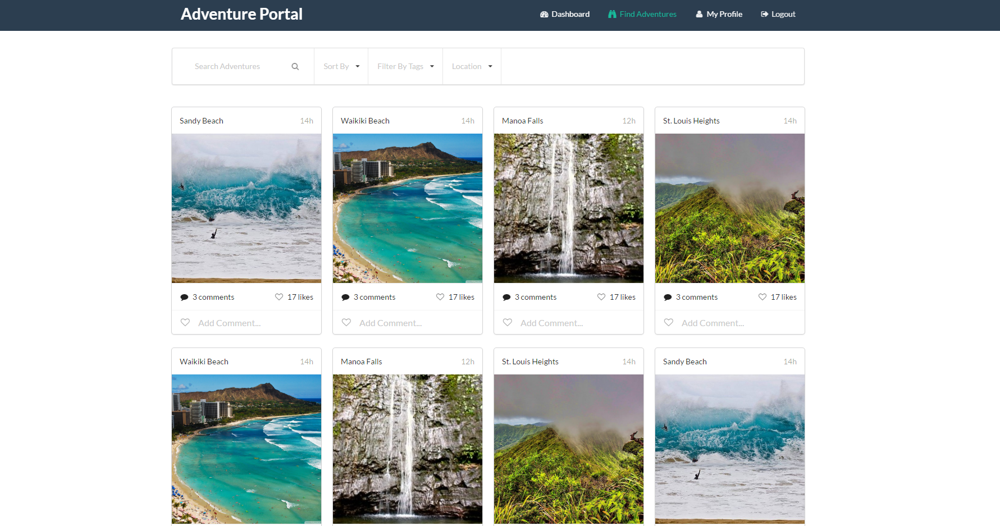
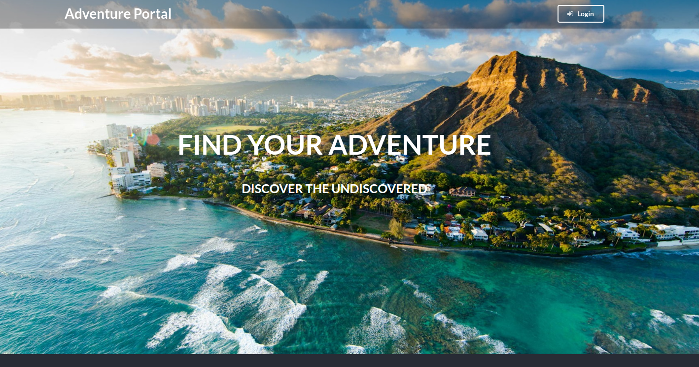
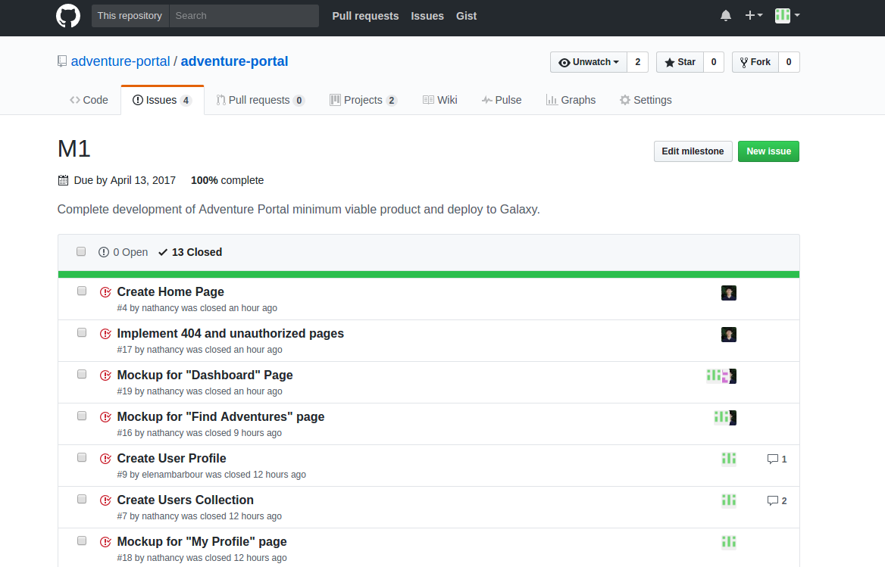
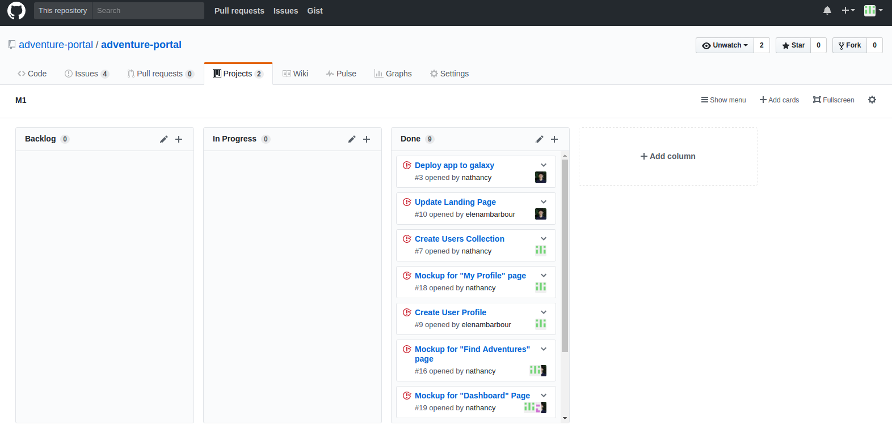
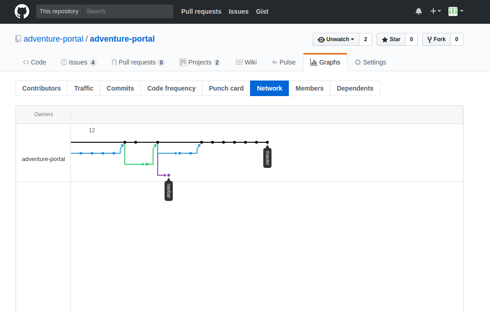

# Table of Contents

* [About Adventure Portal](#about-adventure-portal)
  * [Key Features](#key-features)
  * [Navigation](#navigation)
* [Development History](#development-history)
  * [Milestone 1](#milestone-1-basic-product-and-deployment)
  * [Milestone 2](#milestone-2-data-models-routing-and-ui)

# About Adventure Portal
[Adventure Portal](http://adventure-portal.meteorapp.com) is a tool built by students at the University of Hawaii to help members of the UH community with find exciting adventures to embark on and organize activities with similar minded people. Have an awesome hangout spot that would be perfect on the weekends? Want to share your best getaway activity? Or do you just want to explore and find something new with other students who just want to do the same?

Let Adventure Portal help you explore your interests and help you embark on your next adventure.

### Try Adventure Portal Now! [Adventure Portal](http://adventure-portal.meteorapp.com)
## Key Features
* Create profiles that list your interests
* Create activities that other people can browse and join
* Secure login via the UH authentication system
* Browse for new activites and adventures based on your interests

## Navigation
### Landing Page
Logged out users are presented with information about Adventure Portal and are unable to view featured activities until the user logs in. The user can log in by selecting the "login" link on the top right of the navigation bar. 

### Home Page
After logging in, the user's dashboard with pinned projects are shown as well as featured/suggested activities. These matches are based on the interests listed in the user's profile. For a new user with no added activities, the Portal will ask the user to update his/her interests in order to present similar related activities. 

### Find Adventures Page
Users can find new adventures created by the community and sort by the most popular or upcoming events.

### User Profile Page
Display name, email, interests, photo, and bio of the user. Also displays adventures the user has favorited

# Development History

## Milestone 1: Basic Product and Deployment
The goal of Milestone 1 is to have a minimum working product of Adventure Portal. Milestone 1 was completed on April 13, 2017.

The following pages and features will be implemented:
* Home Page
  * Display a landing page if user is not logged in
  * Display the user's dashboard if logged in
* ~~Calendar Page~~ (Pushed back)
  * ~~User can view different activites on a calendar~~
  * ~~Able to filter activites by tags and/or location~~
* ~~Activites Creation Page~~ (Pushed back)
  * ~~Fields~~
    * ~~Title~~
    * ~~Description~~
    * ~~Upload Image~~
    * ~~Related Interests~~
* **Dashboard Page**
* **Find Adventures Page**
* **User Profile Page**
* Implement UH CAS Login
* UsersCollection
* ActivitesCollection
* Deploy Adventure Portal to Galaxy

Mockups for the following pages were developed.
Expanded on some themes in the pages we had for the final-project mockup.
Note: Some pages will not display until you are logged in. To login, use the dropdown.

Landing page: Added more content to the landing page

CAS login page: Implemented the CAS login (one of the requirements)

Dashboard page: Implemented cards with hover over hidden icon buttons for saving and adding to calendar options. Organized by recent activity and upcoming events

Find adventures page: Search for adventures/events.

My profile page: Implemented profile using seed data for user collection to show visual.

404 page: In case user navigates to unsupported link

Unauthorized Page: In case user tries to navigate anywhere without signing in or proper authorization

Milestone 1 was implemented as AdventurePortal GitHub Milestone M1:

Milestone 1 consisted of thirteen issues, and progress was managed via the AdventurePortal GitHub Project M1:

Each issue was implemented in its own branch, and merged into master when completed:

## Milestone 2: Data Models, Routing, and UI
The goal for Milestone 2 is to create tests for the data models, complete ActivitesCollection, connect data models to UI, provide routing from cards, icons, and buttons, and to continue working on the UI and layout of the site. Milestone 2 is implemented and managed as [Adventure Portal Milestone M2.](https://github.com/adventure-portal/adventure-portal/projects/2) Milestone 2 began on April 13, 2017.
