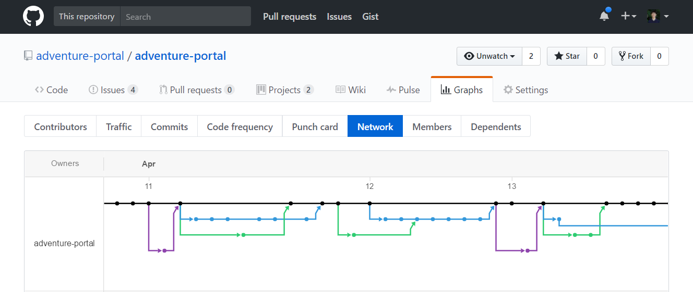

# Table of Contents

* [About Adventure Portal](#about-adventure-portal)
  * [Key Features](#key-features)
  * [Guided Tour](#guided-tour)
* [Development History](#development-history)
  * [Milestone 1](#milestone-1-basic-product-and-deployment)
  * [Milestone 2](#milestone-2-data-models-routing-and-ui)
  * [Milestone 3](#milestone-3-filtering-and-search-favorite-adventures-adventure-details)
  
# About Adventure Portal
[Adventure Portal](http://adventure-portal.meteorapp.com) is a tool built by students at the University of Hawaii to help members of the UH community with find exciting adventures to embark on and organize activities with similar minded people. Have an awesome hangout spot that would be perfect on the weekends? Want to share your best getaway activity? Or do you just want to explore and find something new with other students who just want to do the same?

Let Adventure Portal help you explore your interests and help you embark on your next adventure.

### Try Adventure Portal Now! [Adventure Portal](http://adventure-portal.meteorapp.com)
## Key Features
* Create profiles that list your interests
* Create activities that other people can browse and join
* Secure login via the UH authentication system
* Browse for new activites and adventures based on your interests

# Guided Tour
### Landing Page
Logged out users are presented with information about Adventure Portal and are unable to view featured activities until the user logs in. The user can log in by selecting the "login" link on the top right of the navigation bar. 


### Home Page
After logging in, the user's dashboard with recent/popular activities and upcoming events are displayed as these suggestions are based on the interests listed in the user's profile. For a new user with no added activities, the Portal will ask the user to update his/her interests in order to present similar related activities. 


### Find Adventures Page
Users can find new adventures created by the community and sort by the most popular or upcoming events. In additions, filters such as highest rated, interest tags, and activity location allow users to quickly search community favorites. Users are able to pin and favorite adventures that interest them which will be saved to their dashboard. 


### Add Adventures Page
Users can add their own adventures to share with the community!


### My Profile Page
Your profile page is where you can write your bio, list your interests, and view your pinned/favorited activities. You should make sure to edit your interests to make discovering new adventures easier!


### Unauthorized Page
In case the user tries to navigate anywhere without signing in or lacking authorization. Sometimes you want to "accidently" go into another user's personal space. Sorry, we don't allow that! But don't worry, we'll directly you back safely!


### 404 Page
In case the user navigates to a nonexistent url. We all get lost at times. No worries, you can safely teleport back home! 


# Developers Guide

* To begin working on Adventure Portal, [Meteor](https://www.meteor.com/) must be installed on your machine. 
* Create a directory to hold the project
* Clone the project to your machine with:
```
git clone https://github.com/adventure-portal/adventure-portal.git
```
* cd into the app/ directory and install libraries with:
```
meteor npm install
```
* Run the application with:
```
meteor npm run start
```
* Test that Adventure Portal is running on localhost:3000 from any browser. If you have an account on the UH test CAS server, you can login. Note: It may take some time to build the project and start up the application after running the commands.

From here, you can use the editor of your choice to begin modifying Adventure Portal's files. Note that Adventure Portal uses the coding style preferences described by this xml [file](http://courses.ics.hawaii.edu/ics314f16/morea/development-environments/ics-se-code-style.xml). To get an idea of the project structure, it is helpful to note that Adventure Portal is based on the meteor-application-template available [here](https://ics-software-engineering.github.io/meteor-application-template/).

# Development History
The development process for Adventure Portal consisted of a sequence of milestones which included issues corresponding to 2-3 day tasks. Github projects were used to manage the processing of tasks during a milestone. 

The following sections document the development history of Adventure Portal.

## Milestone 1: Basic Product and Deployment
The objective was to complete minimum viable product development of Adventure Portal. Milestone 1 was completed on April 13, 2017.

The goal of Milestone 1 was to create a set of HTML pages providing a mockup of the pages in the system. Each page was developed as a template and [FlowRouter](https://github.com/kadirahq/flow-router) was used to implement routing to the pages. For login authorization using the University of Hawaii test CAS system, templates from [meteor-example-uh](http://ics-software-engineering.github.io/meteor-example-uh-cas/) were used to guide the implementation. Adventure Portal allows anyone with a UH account to access the system.In addition, authorization was implemented such that users cannot access the profile or filter page associated with another user.

The following pages were implemented:
* Landing Page
* Home Page (Dashboard)
* Find Adventures Page
* My Profile Page
* 404 Page

The following features were implemented:
* UH CAS Login
* UsersCollection
* ActivitiesCollection
* Deploy Adventure Portal to Galaxy

Stretch goals
* ~~Calendar Page~~ (Pushed back)
  * ~~User can view different activites on a calendar~~
  * ~~Able to filter activites by tags and/or location~~
* ~~Activites Creation Page~~ (Pushed back)
  * ~~Fields~~
    * ~~Title~~
    * ~~Description~~
    * ~~Upload Image~~
    * ~~Related Interests~~

Milestone 1 was implemented as [Adventure Portal GitHub Milestone M1](https://github.com/adventure-portal/adventure-portal/milestone/1):
  


Milestone 1 consisted of thirteen issues, and progress was managed via the [Adventure Portal GitHub Project M1](https://github.com/adventure-portal/adventure-portal/projects/1):


Each issue was implemented in its own branch, and merged into master when completed:



## Milestone 2: Data Models, Routing, and UI
The objective was to implement data collections to hold user profiles/activities, dynamic routing, and UI upgrades. Milestone 2 was completed on April 27, 2017. 

The goal for Milestone 2 was to implement tests for the data models, complete the ActivitesCollection and UsersCollection, connect data models to the UI, provide dynamic routing from cards, icons, and buttons, implement dynamic page authentication routing, and to continue working on the UI and layout of the site. The main goal was to implement the data models: the underlying set of Mongo Collections and the operations upon them that would support the Adventures Portal application. We implemented the data model as a set of JavaScript classes. The ActivitiesCollection class and the UsersCollection class provides common fields and operations as these two classes inherit from BaseCollection and provided the persistent data structures useful for Adventure Portal. 

The following pages were implemented:
* Loading/Spinner Page

The following features were implemented:
* Dynamic routing for all pages
* User authorization
* ActiviesCollection, UsersCollection, and InterestsCollection
* Data model connection to pages
* Landing page animations
* More content on all pages
* Logo
* On-scroll transparent disappearing navigation bar

Milestone 2 was implemented as [Adventure Portal GitHub Milestone M2](https://github.com/adventure-portal/adventure-portal/milestone/2?closed=1):


Milestone 2 consisted of eleven issues, and progress was managed via the [Adventure Portal GitHub Project M2](https://github.com/adventure-portal/adventure-portal/projects/2):


Each issue was implemented on its own branch, and merged into master when completed:


## Milestone 3: Filtering and Search, Favorite adventures, Adventure details
The objective of Milestone 3 is to implement a saving feature so users can save their favorite adventures, connect the user's favorite activities from the data model to display on their profile, and also to add a page that will allow user's to add their own adventures.  More work will be done on the UI as well. Milestone 3 will begin on April 27, 2017 and will end on May 9, 2017.

The following pages were implemented:
* Dynamic activity detail page

The following features were implemented:
* Initial database adventures
* Favorite adventure feature
* Filtering/Search
* Dashboard/Find adventure page UI upgrades
* Save adventures to profile page

Milestone 3 was implemented as [Adventure Portal GitHub Milestone M3](https://github.com/adventure-portal/adventure-portal/milestone/3?closed=1):


Milestone 3 consisted of seven issues, and progress was managed via the [Adventure Portal GitHub Project M3](https://github.com/adventure-portal/adventure-portal/projects/3):


Each issue was implemented on its own branch, and merged into master when completed:


# Initial User Study

We surveyed five members of the UH community. We gathered feedback by asking the test users to perform the tasks of adding, editing, and saving an activity, filterting through activities, and browsing through adventures to see if there were any points of confusion along the way. We had the following people test the application.

* Allie Kim
* Kevin Wong
* Kevin Cho
* Andrew Obatake
* Joslyn Hamada

We received the following feedback:

* User Experience
  * UH CAS is great
  * Favorite button should be larger
  * Hide menubar when scrolling down
  * Entire cards should be clickable
  * Be able to upload profile pictures instead of linking urls only
  * Editing profile is streamlined
  * Aesthetic 
  * Animations are cool
  
* Adventures/Dashboard pages
  * Browsing through activities is very easy
  * Need feedback notification to notify user when successfully favorited activity
  * Make button to favorite larger
  * Create notifications for most recent activities
  * Specific detail page of each project should provide more details
  * Would be nice to add "back" button after clicking an activity
  * Add ability to favorite activity on its detail page
  * Would be nice to have a "scroll to top" button at the bottom of each page
  * Add notification when remove favorited activity
  
* Profile
  * Ability to edit a specific field instead of having to update all fields
  * Automatic email and username from CAS UH login is cool
  * After saving/editing changes, should route back to profile page
  
* Search
  * Would be cool to search for name of activities instead of only interests
  * Add a button to clear all filters
  * Make it so all interest tags are not already shown

# Contributors
  * [Nathan Lam](https://nathancy.github.io/)
  * [Dylan Nakahodo](https://dylannakahodo.github.io/)
  * [Elena Barbour](https://elenambarbour.github.io/)
  

